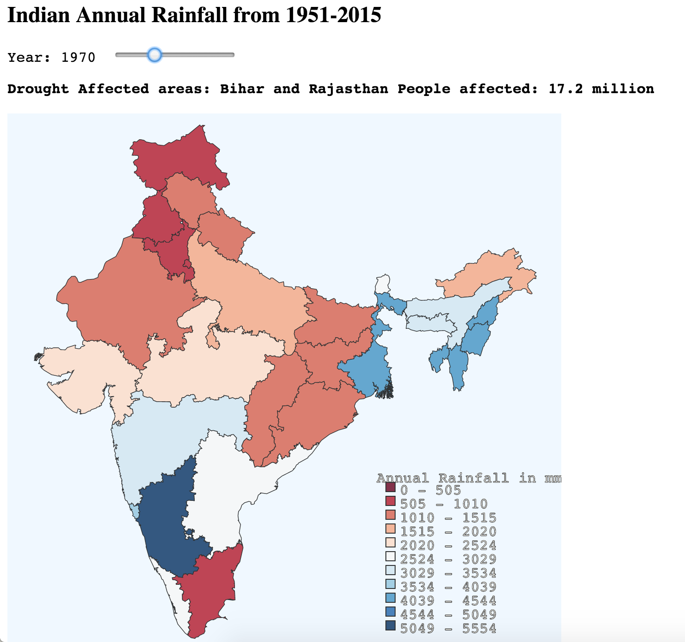

# Chloropleth

A chloropleth is a map in which areas are shaded in proportion to the statistical variable being measured. See the visualization [here](http://deborah-digges.github.io/indian-rainfall-viz/chloropleth/). 

### Variable being measured

- The variable being measured is the annual rainfall over indian states
- Time is another dimension. We show values over time by using a sliding ruler to change the time period.

### Color Scale used

A divergent scale, with blue and red at the two ends of the scale, is used. This color scheme was created using the wonderful tool [ColoBrewer](http://colorbrewer2.org/). 
- Dark Blue values indicate regions of heavy rainfall 
- Dark Red values indicate regions of scanty rainfall

### Annotation of events

Additionally, I've tried to annotate the map with the major events that happened in the corresponding years. Source: [Outlook India](http://www.outlookindia.com/article/india-the-history-of-drought/209341).

### Preview

